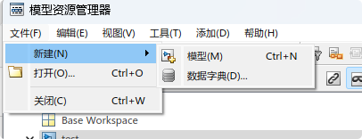
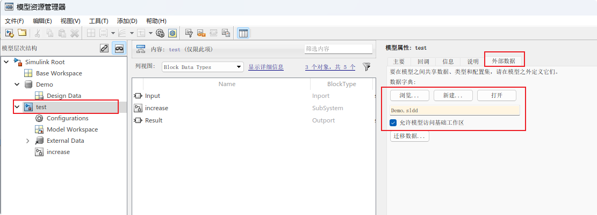
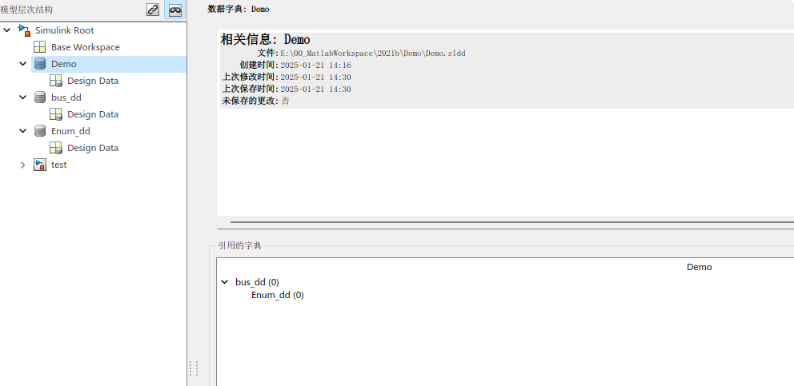
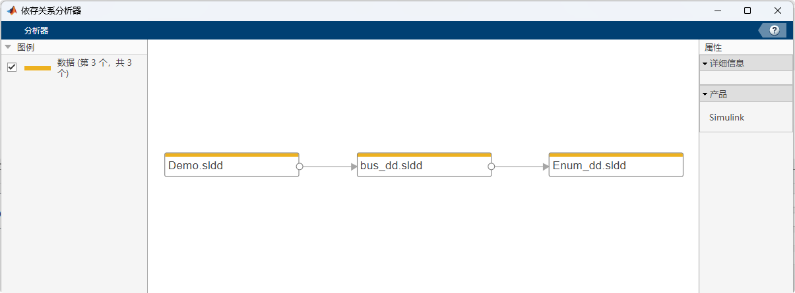

# 数据的存储

> 在模型搭建中, 我们会使用到各种各样的数据, 输入 输出 参数 自定义信号等
>
> 对于一个数据来讲, 又包含其数据类型的指定, 数值设定. 如果涉及到代码生成, 还要关注其在代码中声明和定义的方式
>
> Simulink模型搭建模型仿真时可以比较随意地设置, 很少影响仿真结果. 但当需要代码生成时, 相关变量的定义与使用要求就会比较严格, 避免代码集成时造成编译错误

# 常见的数据存储方式

## 存放在m脚本中

> 在m脚本中依次定义数值

### 定义参数(Parameter)

```m
% define `Param01` as a Paramenter
Param01 = Simulink.Parameter;
% set default value as 1
Param01.Value = 1;
Param01.Complexity = 'real';
% `CodeInfo` define properties which influence how code generate
Param01.CoderInfo.StorageClass = 'Custom';
Param01.CoderInfo.Identifier = '';
Param01.CoderInfo.Alignment = -1;
% when generate, Model whill include <demo.h> which defined Param01
Param01.CoderInfo.CustomStorageClass = 'ImportFromFile';
Param01.CoderInfo.CustomAttributes.HeaderFile = 'demo.h';
Param01.CoderInfo.CustomAttributes.PreserveDimensions = false;
Param01.Description = 'Parameter export Demo for blog';
Param01.DataType = 'uint8';
Param01.Min = 0;
Param01.Max = 15;
Param01.DocUnits = 'm';
```

将上述命令保存为一个m文件并运行, 此时工作区能生成一个Parameter变量, 其属性与命令行定义一致

生成c代码:

```c test_private.h
#include "demo.h"
```


### 定义数据类型(AliasType)

m命令定义

```m
Demo_U8 = Simulink.AliasType;
Demo_U8.Description = '';
Demo_U8.DataScope = 'Auto';
Demo_U8.HeaderFile = '';
Demo_U8.BaseType = 'uint8';
```

生成c代码:

```c
typedef uint8_T Demo_U8;
```

----

### 其他注意事项

> 除以上外, 常用的 还可以定义枚举, 总线(bus 对应代码中的结构体类型)等等
>
> 可以将各种各样的定义全部汇集到一个m文件中, 模型需要运行时运行该文件, 可依次在工作区内新建各种类型与变量
>
> **m文件执行时按照从上至下的顺序执行, 因此, 数据类型的定义一定要先于用到该类型变量的定义, 否则运行时会报错** 

m脚本基础结构

1. base data type define(Alias Enum)
2. bus define(in case bus element using costume base datatype)
3. signal parameter define

> **m脚本必须运行数据方可加载到工作区**, 所以每次在模型编译前, 务必保证所需要的数据均已加载

## 存放在数据词典(sldd)中

> 数据词典(sldd)类似于一个工作区, 其中可定义各种各样的数据类型及变量, 当打开该词典时, m命令和Simulnk模型可获取其中的内容
>
> sldd提供可视化的操作界面, 可以摆脱命令行的限制, 方面维护

### sldd新建

***命令行新建***

略

***模型资源浏览器(Model Explorer)新建***

> 在模型空白处点击鼠标右键, 选择第一个`Explorer`即可打开
>
> 如没有模型, 可在Matlab命令行输入`daexplr`打开

`文件-> 新建` 选择数据词典



### sldd操作

***新增属性或变量***

选中sldd中的`Design Data`, 工具栏中`添加`即可添加各种类型与变量


> 基础工作区也可使用操作, 选中`Base Workspace`即可

***数据在基础工作区与sldd之前的移动与复制***

在模型资源浏览器中, sldd中的数据和工作区中的数据可任意剪切复制, 且支持拖动操作. 故如果要将由m脚本存储的数据转换为由sldd维护, 可运行m脚本将数据加载至基础工作区, 打开资源浏览器, 选中基础工作区内的所有变量, 直接拖入sldd中保存即可

***sldd与模型的链接***

模型属性中可链接到其需要引用的sldd文件, 引用后打开模型时会自动加载sldd, 可省去手动打开sldd的麻烦



### sldd的嵌套

在Matlab设计中, 一个模型只可引用一个数据词典, 如果数据类型, 标定参数, 信号量在多个数据词典中维护时, 需要使用sldd的嵌套

所谓sldd嵌套, 是因为sldd可以引用另外的sldd
sldd的引用规则与[m语言定义数据结构](#其他注意事项)类似, 此sldd引用到的数据类型定义, 必须在引用的sldd中体现, 具体如下:





> `Demo.sldd`中使用了由`bus_dd.sldd`定义的总线;
> 
> `bus_dd.sldd`总线元素中使用了由`Enum_dd.sldd`定义的枚举