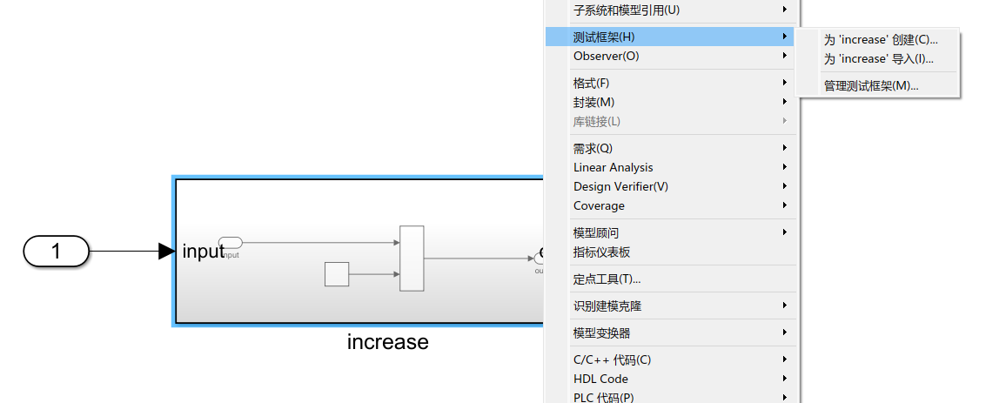
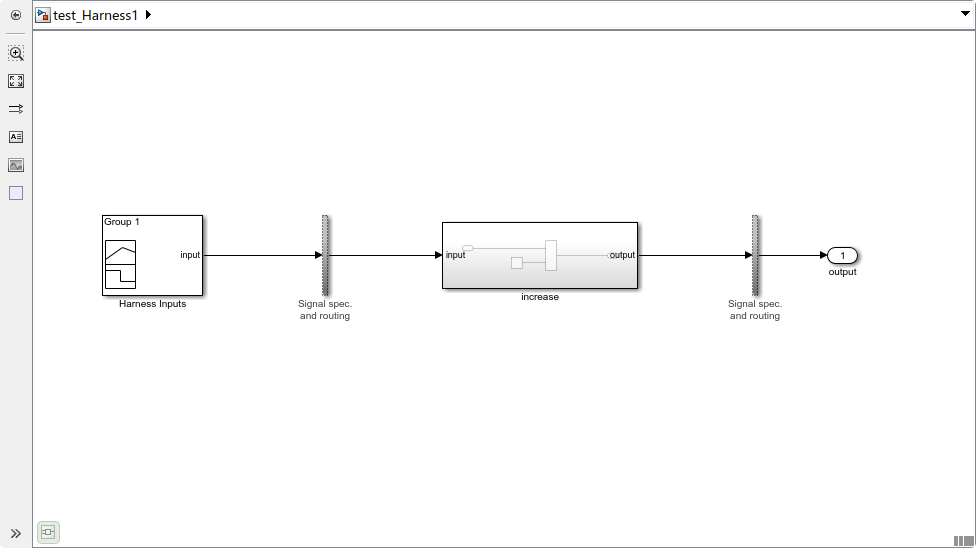
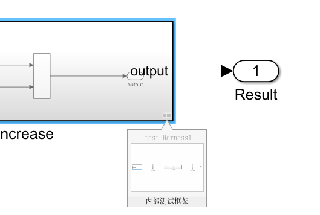
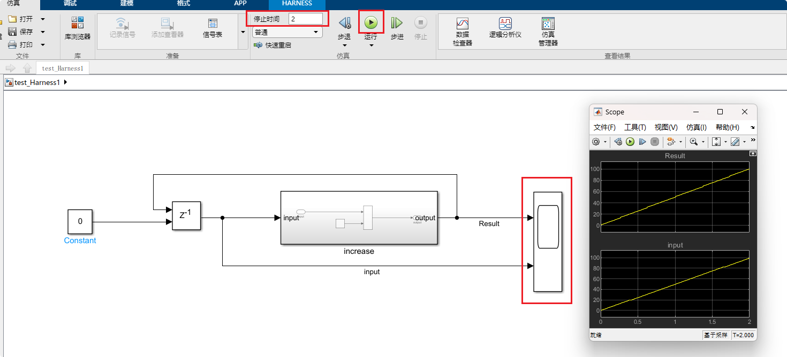
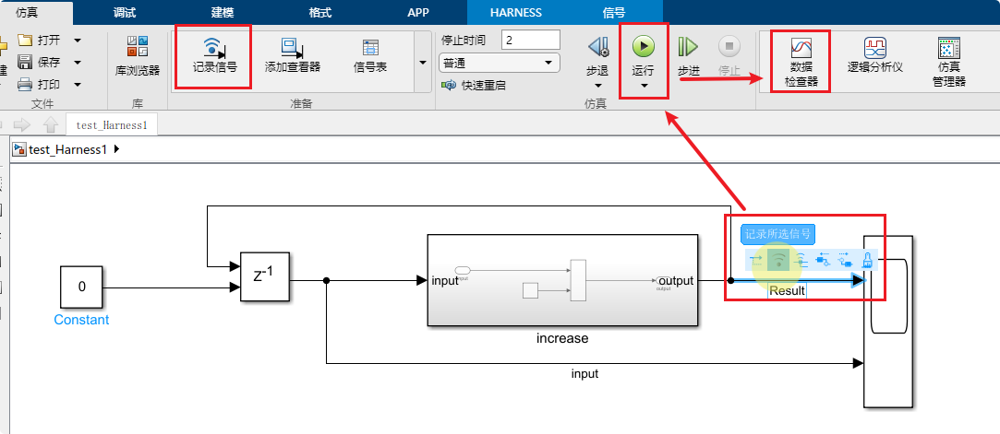

# 仿真

## 调试

Simulink提供全面的调试工具, 可设置调试时间, 暂停时间, 设置断点, 查看信号当前值等等

- 叠加信息: 运行时将模块或信号的数据显示出来, 例如运行顺序, 模块类型, 信号属性等等
- 工具: 可向前向后追溯选中信号, 注释模块, 显示信号当前值等等
- 断点:
    - 信号条件断点, 当信号条件满足特定情况时暂停
    - 时间断点, 运行到暂停时间时自动暂停
- 编译
    - 更新模型: 检测整个模型内是否缺少必要量(例如模型中用到的变量缺少定义)
    - 更新模块: 更新所在模块
    - 更新图: 更新当前所在StateFlow
- 仿真 设置仿真时间, 开始运行, 步进步退等

## 新建测试框架

### 创建测试框架

为当前模块添加仿真测试框架 `模块右键 -> 测试框架 -> 新建测试框架 `

> 创建仿真测试框架前需保证当前模型运行无报错, 因为创建测试框架时, Simulink会尝试运行该模型
> 2021版本Matlab测试框架会保存在模型文件中, 不会另外生成单独测试模型

### 管理框架

新建测试框架的模块有下角有特定图标, 点击可显示为该模块添加的测试框架(也可通过`模块右键 -> 测试框架 -> 管理测试框架 `用来打开删除框架)

### 编辑测试框架

新建框架时, 可选择基础的输出与输出(普通输入输出端口, 使用SignalBuilder作为输入, Scope作为输出等等), 测试框架本质上仍是一个普通的模型, 可对其做任何对模型可做的更改

## 仿真

### 激活仿真

将以上框架修改, 将上个周期的输出作为输入再次计算, 添加Scope观测窗口, 设置仿真时间为2s, 点击运行

Scope像示波器一样记录仿真过程中其输入端口的输入值

### 信号观测

#### Scope示波器

Scope模块记录仿真时输入端口输入的信号值的变化

> 输入端口的信号线上需要命名, 该命名会体现在Scope显示框上用于区分不同信号

#### Display显示模块

Display显示当前值, 不可回放(**不建议用**)

#### 数据查看器

使用数据查看器回放数据前, 必须记录该信号(记录后, 信号接口处会出现一个类似Wifi信号强度的图标)

运行完毕后, 点击数据查看器可回放数据. 当模型比较复杂需要记录多个模块, 多层信号时, 使用数据查看器比较方便快捷, 同时数据查看器还支持数据对比, 可以对比本次与上次之间的差别

