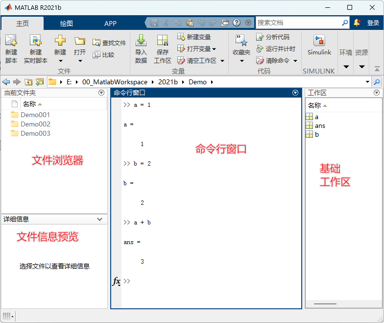
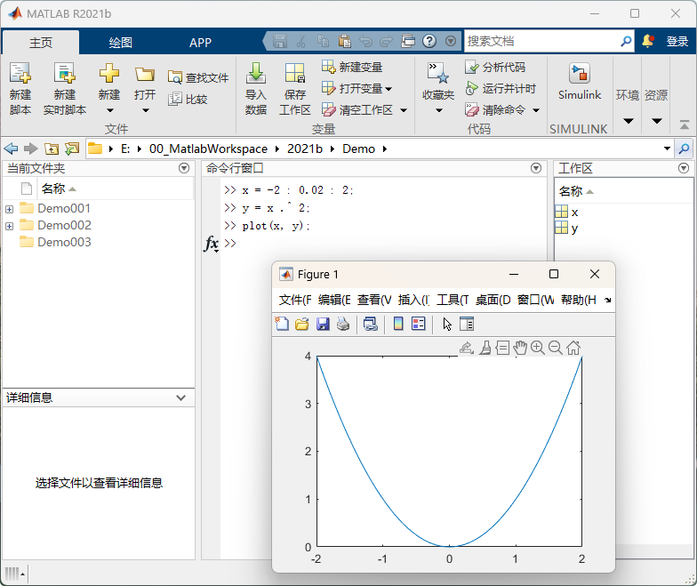
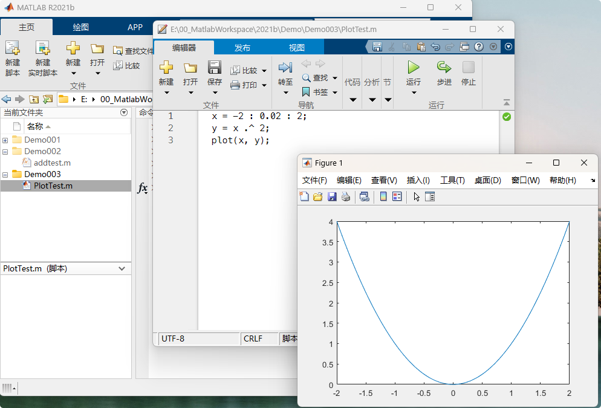
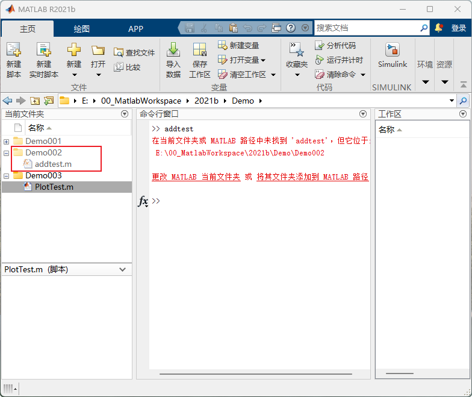
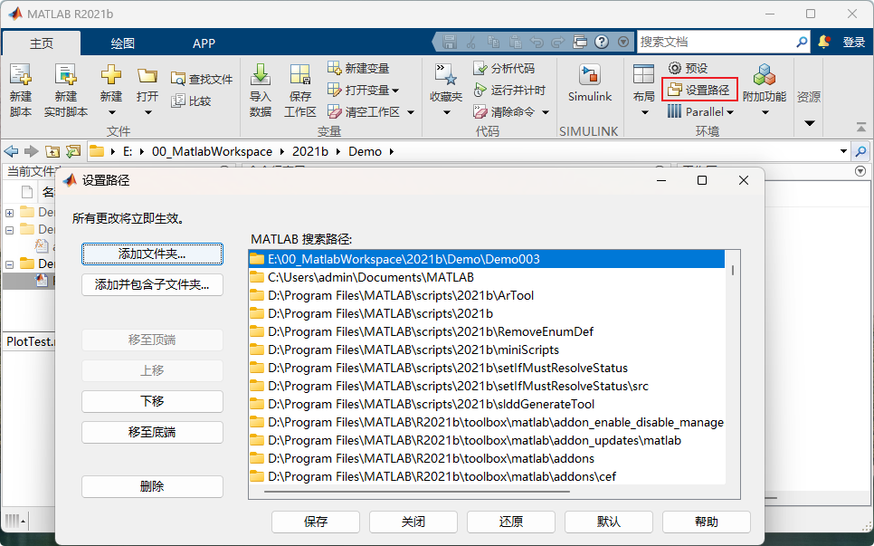

# Matlab使用基础操作

----

## 应用界面



### 菜单栏

略

> (和Simulink没太大关系)

### 文件浏览器

浏览文件文件夹, 可导航到任意想要操作的文件夹

默认打开时为Matlab安装目录, 如需更改, 可编辑Matlab快捷方式 "起始位置" 属性, 例如 `E:\MatlabWorkspace`

打开后文件夹与文件为灰色, 右键有选项`添加到路径 -> 选定的文件夹 | 选定的文件夹与子文件夹`, 详细说明见[设置路径](#设置路径)


### 命令行窗口

#### 数值计算

```matlab
>> 1 + 1

ans =

     2

>> 
```

#### 调用函数

命令行依次输入以下命令, 调用绘图函数

> 命令行末尾添加分号"`;`"不会立即输出当前变量值

```matlab
x = -2 : 0.02 : 2;
y = x .^ 2;
plot(x, y);
```



#### 运行脚本

脚本为一串命令的集合

将以上命令添加到m文件中, 点击运行, 输出与上面同样



### 基础工作区(Base WorkSpace)

基础工作区用于缓存命令行中定义的变量, 可直接双击查看编辑属性

脚本与Simulink模型均能直接获取工作区中的变量

## 设置路径

路径中包含的脚本与模型可以理解成Matlab可直接获取的, 否则可能需要使用绝对路径才能获取(函数必须包含路径才能正常调用)



`菜单栏 -> 环境 -> 设置路径`中可以查看当前包含的路径, Matlab有默认包含的文件夹, 根据工程需要按需包含, 自定义脚本可放在统一文件夹设置默认包含, 方便直接调用

