# StateFlowDesign

----

## StateFlow简介

### 状态

就是状态, 每个StateFlow只能处于一个状态, 状态机只会停留在某个状态, 不能停留在流转线或点上

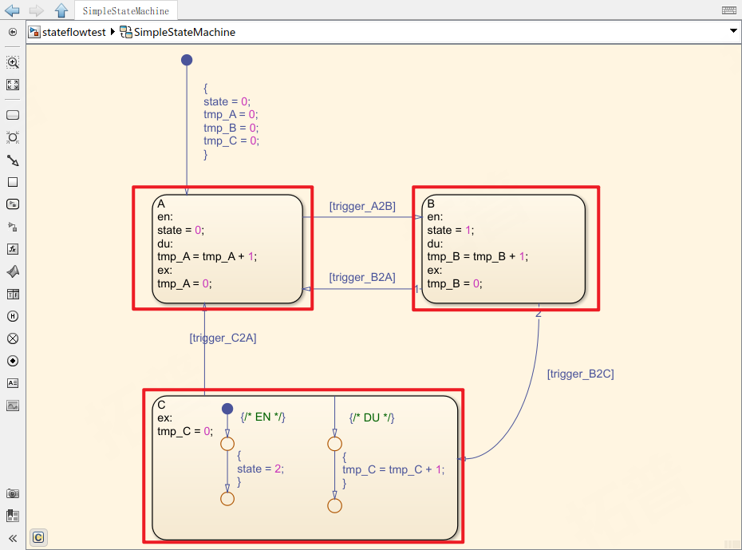

> `A` `B` `C` 为改StateFlow的三个状态

### 条件

状态跳转的条件, 条件满足时, 箭头激活使状态跳转

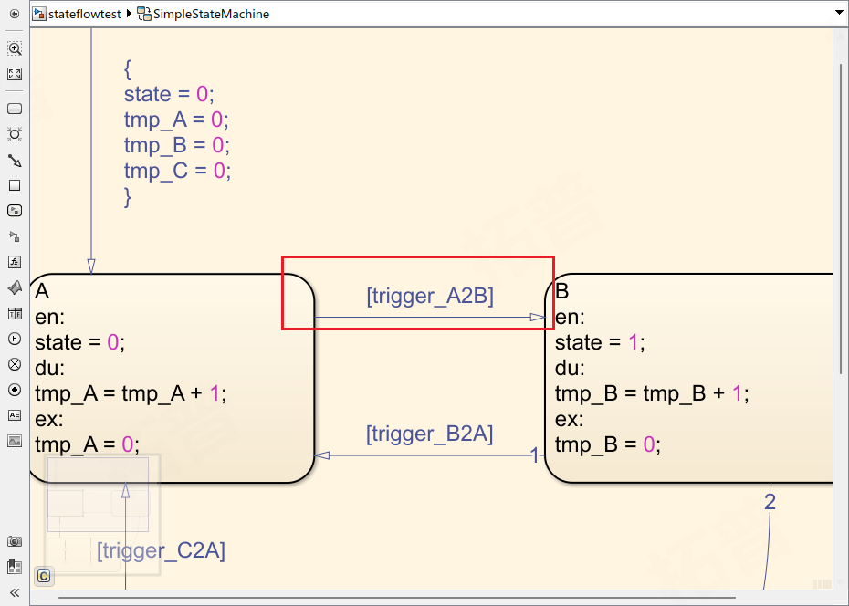

> 当状态处于`A`时, `trigger_A2B`为true, 状态将会跳转到`B`
> 条件指令由 `[` `]` 包围

### 执行

> StateFLow中执行从起始点开始, 通过`条件`判断流程图走向, 执行不同命令

命令行主要分在两个部分
1. 状态流转线上的`{ }`中
2. 状态内的 `en` `du` `ex`后

#### 立即执行

流转线上的大括号内:

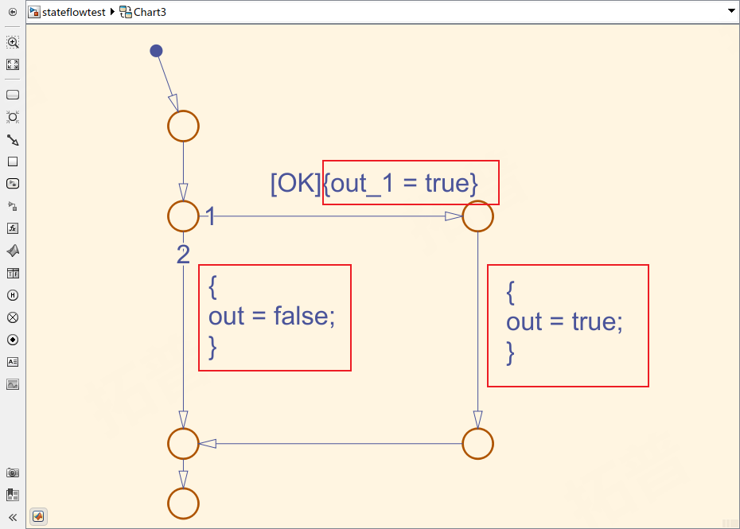

> 无状态的StateFLow, 从起始点一直执行到最后

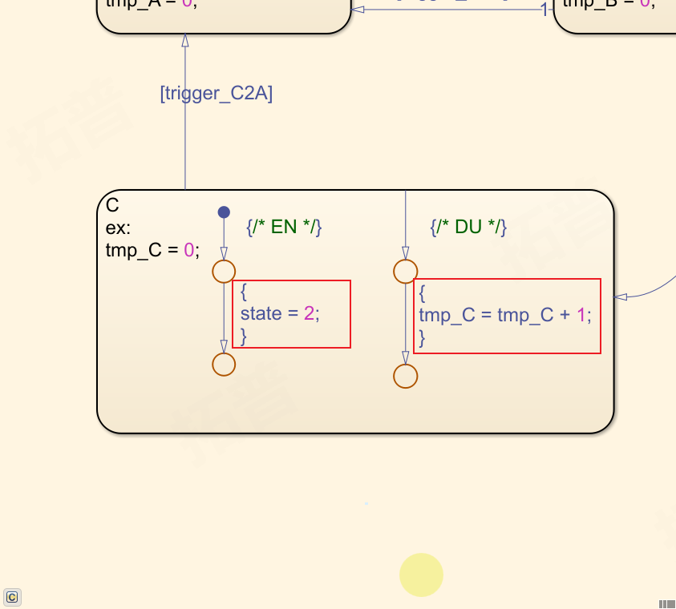

> 状态内部也可搭建流转线执行指令

#### EN

当刚刚进入某个状态的第一个周期执行`en`后的内容

EN的搭建方式用两种:

**1) 以`A`状态为例**

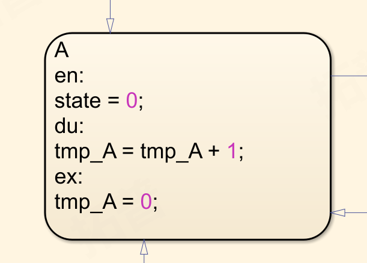

当进入该状态时, 立即执行`en`后的指令, 将`state`赋值为0

**2) 以`C`状态为例**

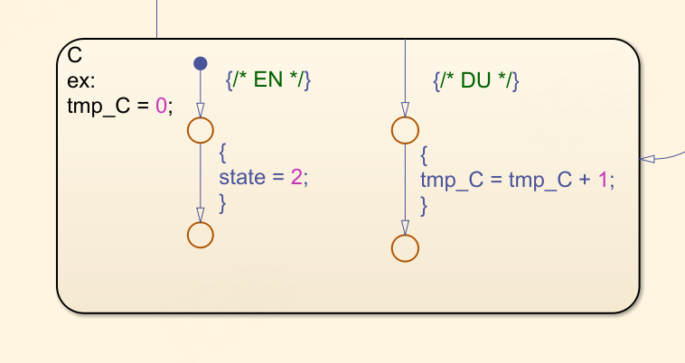

在状态中添加起始点, 效果等同于`en`

#### DU

进入某个状态的第二个周期开始, 执行`du`之中的内容

与`EN`类型, 搭建方式也有两种  

**1) 以`A`状态为例**

当进入该状态后, 执行`du`之后的指令, 将`tmp_A`加一 (图示如EN中)

**2) 以`C`状态为例**

将流转线连接至状态框上, 效果等同于`du`(图示如EN中)

#### EX

当状态跳转, 要退出该状态时执行的指令

位于`ex`关键字之后(图示如EN中)
退出指令只能通过`ex`关键字知名, 无法搭建流转线

> ***使用 `en` `du` `ex`关键字与流转线的对比:***
> 关键字无法执行判断语句, 仅支持简单的数值运算(可通过调用函数来实现)
> 使用流转线可与直观搭建判断与循环指令

## StateFlow中的Function

> StateFlow中可调用函数来执行复杂操作, 使页面更加简洁明了

### Simulink Function

> 新建Simulink Function, 嵌入一个Simulink模型执行复杂计算, SimulinkFunction视为单独一层, 其拥有单独的输入输出 local变量等, 与调用其的模型仅通过输入输出参数有数据交互

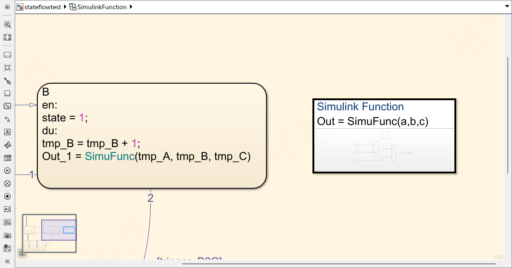

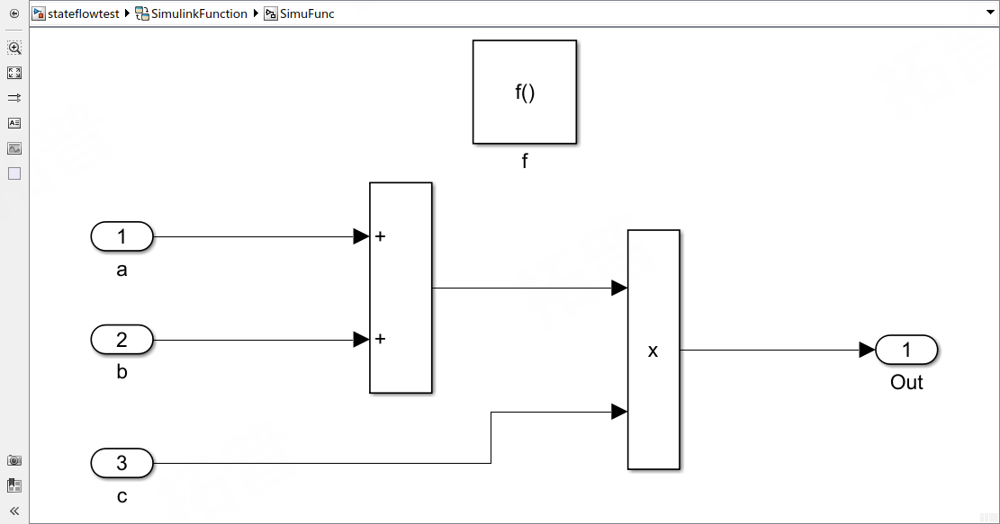

### Graphic Function

> GraphicFunction支持传递参数的函数形式, 同时也支持直接操作改chart内的变量

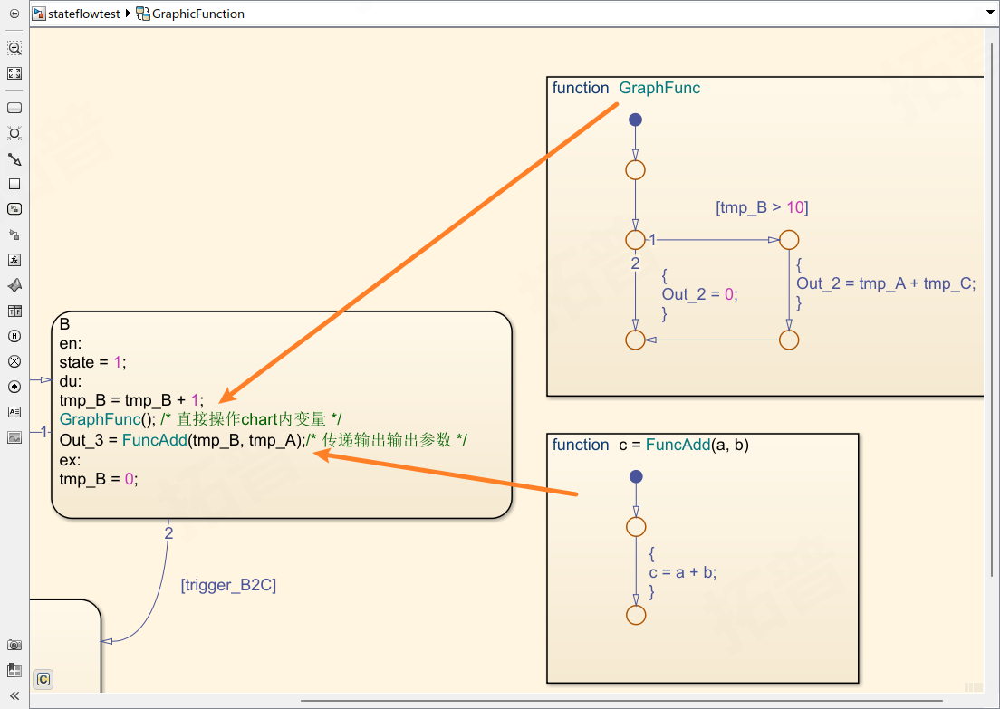

## 常见建模方式

### 基础状态机

> 一层状态机结构, 简单的状态跳转

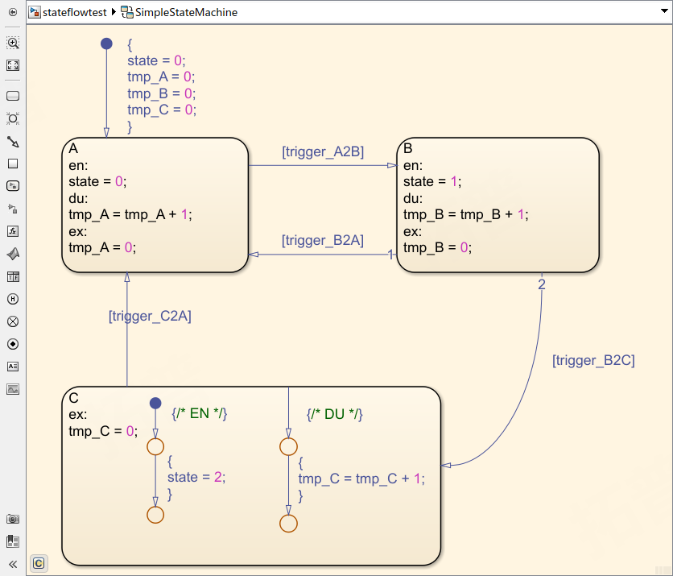

### 嵌套状态机

> 状态机内的状态机, 外层状态机优先于内层

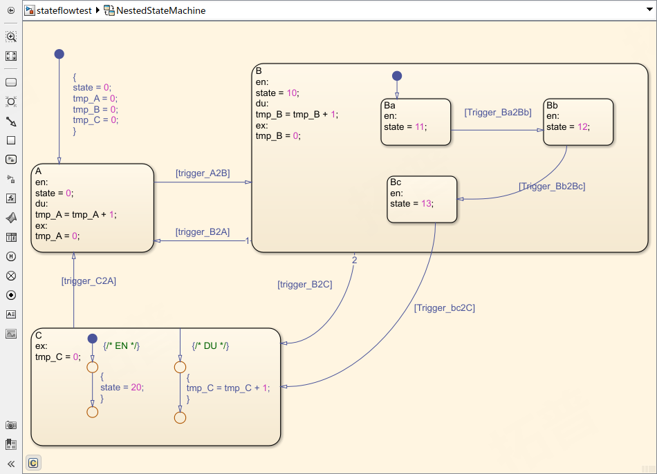

### 并行状态机

> StateFlow允许 '并行' 运行, 共享同样的输入, 输出, 局部变量等

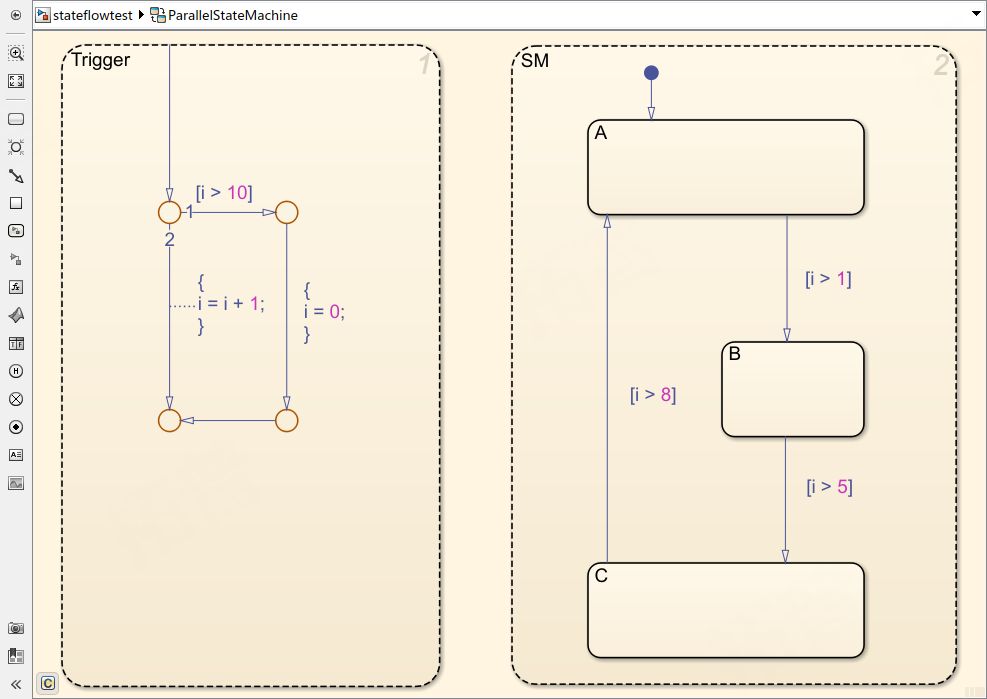

## StateFlow设置

## StateFlow建模建议